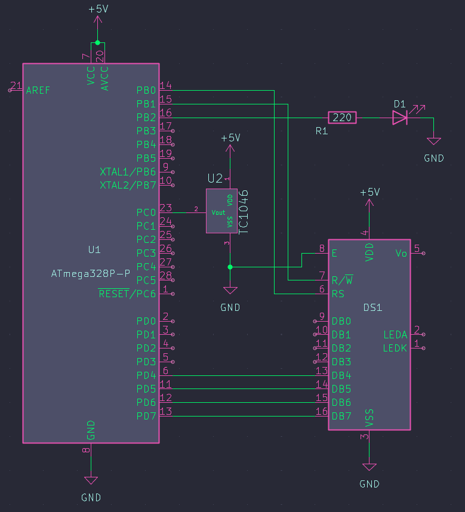
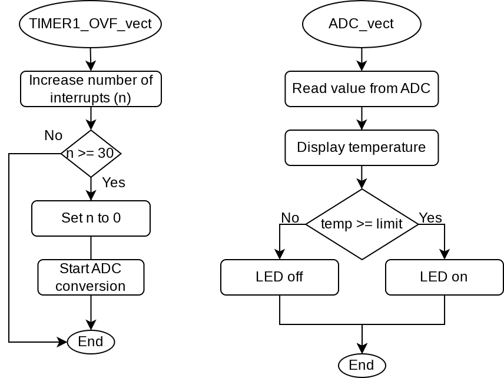

# Lab 5: Filip Stryk

   | **Operation** | **Register(s)** | **Bit(s)** | **Description** |
   | :-- | :-: | :-: | :-- |
   | Voltage reference    | ADMUX | REFS1:0 | 00: ..., 01: AVcc voltage reference (5V), ... |
   | Input channel        | ADMUX | MUX3:0 | 0000: ADC0, 0001: ADC1, ... |
   | ADC enable           | ADCSRA | ADEN |  |
   | Start conversion     | ADCSRA | ADSC |  |
   | ADC interrupt enable | ADCSRA | ADIE |  |
   | ADC clock prescaler  | ADCSRA | ADPS2:0 | 000: Division factor 2, 001: 2, 010: 4, ...|
   | ADC 10-bit result    | ADCL:H | ADC9:0 |  |

### Analog-to-Digital Conversion

1. Complete table with voltage divider, calculated, and measured ADC values for all five push buttons.

   | **Push button** | **PC0[A0] voltage** | **ADC value (calculated)** | **ADC value (measured)** | **ADC value (measured, hex)** |
   | :-: | :-: | :-: | :-: | :-:  |
   | Right  | 0&nbsp;V | 0   | 0  | 0 |
   | Up     | 0.495&nbsp;V | 101  | 143 | 8F |
   | Down   | 1.203&nbsp;V | 246  | 342 | 156 |
   | Left   | 1.970&nbsp;V | 403  | 511 | 1FF |
   | Select | 3.182&nbsp;V | 651  | 731 | 2DB |
   | none   | 5&nbsp;V     | 1023 | 1023 | 3FF |

### Temperature meter

Consider an application for temperature measurement. Use analog temperature sensor [TC1046](http://ww1.microchip.com/downloads/en/DeviceDoc/21496C.pdf), LCD, and a LED. Every 30 seconds, the temperature is measured and the value is displayed on LCD screen. When the temperature is too high, the LED will turn on.

2. Draw a schematic of temperature meter. The image can be drawn on a computer or by hand. Always name all components and their values.

   

3. Draw two flowcharts for interrupt handler `TIMER1_OVF_vect` (which overflows every 1&nbsp;sec) and `ADC_vect`. The image can be drawn on a computer or by hand. Use clear descriptions of the individual steps of the algorithms.

   