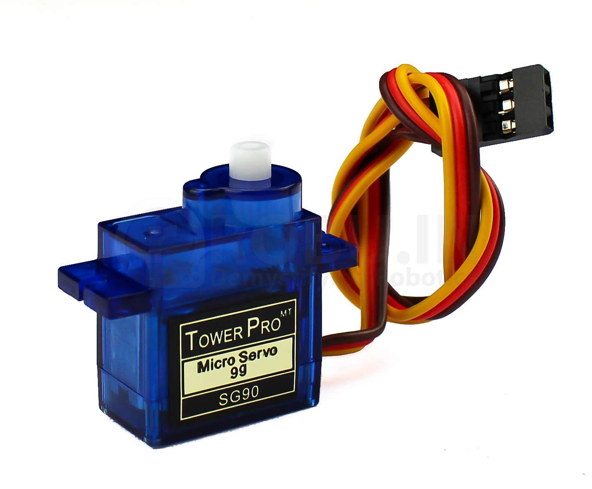

# Servo applicatiton

### Členové skupiny: 
Filip Stryk
* podílel se na programování aplikace

David Pěčonka
* podílel dokumentaci a videu

### Cíl projektu
Cílem projektu byl návrh a následná realizace aplikace, která pro svou funkci využívá joystick a dva servomotory. Naším návrhem je vytvoření ovládání pozice obou servomotorů pomocí pohybu joystickem.

### Struktura projektu
   ```c
   YOUR_PROJECT        // PlatfomIO project
   ├── include         // Included files
   │   └── timer.h
   ├── lib             // Libraries
   │   └── adc
   │        └── adc.c
   │        └── adc.h
   ├── src             // Source file(s)
   │   └── main.c
   ├── test            // No need this
   ├── platformio.ini  // Project Configuration File
   └── README.md       // Report of this project
   ```

### Popis HARDWARE

#### ATMega328p


Piny 9,10 [1]:

- slouží pro připojení dvou servomotorů (PWM)

Piny 2 [2]:

- slouží pro připojení tlačítka, které obsahuje joystick

Piny 0,1 [3]:

- slouží pro čtení informace v jaké poloze se joystik nachází

Tlačitko [4]:

- slouží jako RESET

MicroUSB [5]:

- určeno k nahrávání programu do mikrokontroléru

#### Joystik


- Pin GND slouží k uzemnění
- Pin +5 určen pro napájení joysticku
- Pin Vrx slouží pro určení polohy joysticku v ose x
- Pin Vry slouží pro určení polohy joysticku v ose y
- Pin SW je určen pro přenos informace o tlačítku

Joystick využíváme pro ovládání servomotorů.

#### Dva servo motory 


- Hnedý drátek GND slouží pro uzemnění
- Červený drátek slouží pro napájení 5V
- Oranžový drátek souží pro příjem PWM z mikrokontroleru

### Schéma zapojení

Obr. č. 1 Schéma zapojení v programu SimulIDE

### Popis SOFTWARE

Serveromotory jsou řízený obdélníkovým signálem o frekvenci 50 Hz s pulzně-šířkovou modulací. Serva se natáčí do pozice od 0 do 180° (resp. od -90° do +90°) podle šířky pulzu v rozmezí od 0.6 ms do 2.4 ms.

Pro generování PWM je použit čítač 1 v režimu Phase Correct PWM. V tomto režimu čítač čítá od 0 po hodnotu TOP, uloženou v registru ICR1. Po dosažení této hodnoty změní čítač směr čítání a po opětovném dosažení 0 čítá znova nahoru. Pokaždé, když se aktuální hodnota čítače (v registru TCNT1) rovná hodnotě v registru OCR1A nebo OCR1B pro kanál jedna, respektive 2, tak dojde k negaci aktuální hodnoty na výstupu daného kanálu.

Pro tuto aplikaci byla zvolena předdělička čítače o hodnotě 8. Hodnota TOP pro danou předděličku a potřebnou frekvenci 50 Hz je 20 000. V tomto případě pak hodnota v registrech OCR1A/B odpovídá délce pulzu v mikrosekundách.


* První vývojový diagram znázorňuje nejdůležitější část našeho programu. Pomocí toho, jakým směrem joystickem pohybujeme - zda ve směru osy x resp. ve směru osy y - dle toho se vybírá příslušný kanál. Kanál 0 indikuje pohyb ve směru osy x a kanál 1 pohyb ve směru osy y. Jestliže joystickem pohybujeme doleva či doprava, tak se servo č.1 otáčí. Naopak pokud joystickem pohybujeme nahoru či dolů, tak se otáčí servo č.2.


* Druhý vývojový diagram znázorńuje využití tlačítka zabudovaného v joysticku. Pokud dojde ke stistknutí tlačítka, oba servo motory zaujmou svou výchozí pozici. Výchozí pozice je zde nastavena na střední hodnotu maximálních pozic obou servo motorů.


### Video
https://www.youtube.com/watch?v=-NYkx1fyxWs

### Zdroje

1. https://img.dxcdn.com/productimages/sku_370842_1.jpg
2. https://udvabony.com/wp-content/uploads/2019/05/arduino-joystick-module-1000x1000.jpg
3. https://m.media-amazon.com/images/I/61yfIwAxe0L._SL1421_.jpg

